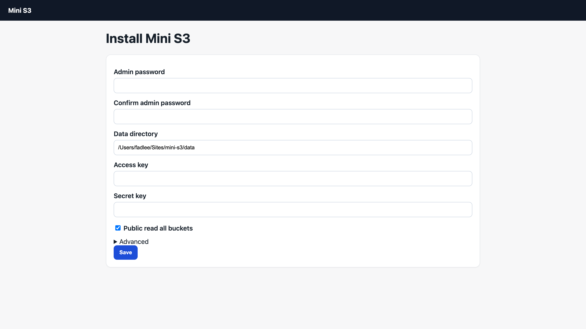
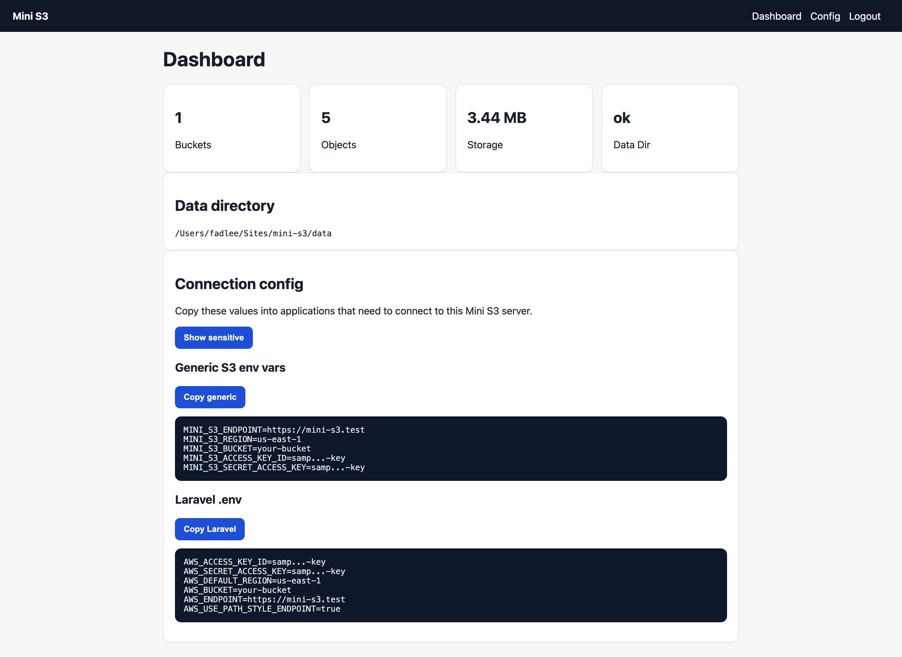

# Mini S3 Server

[](https://opensource.org/licenses/MIT)

A lightweight S3-compatible object storage server implemented in PHP, using local filesystem as storage backend.

## Key Features

- ✅ S3 OBJECT API compatibility (PUT/GET/DELETE/POST)
- ✅ Multipart upload support
- ✅ No database required - pure filesystem storage
- ✅ Full AWS Signature V4 verification (header auth + presigned URL)
- ✅ Lightweight deployment with minimal PHP files


## TLDR

For source installs, set your web server root to this project's `public/` directory. For release zips, extract the archive, set your web server root to the extracted directory, and route all requests to `index.php`.

- **Endpoint**: Your website domain
- **Access Key**: Configured in `CREDENTIALS`
- **Secret Key**: Configured in `CREDENTIALS` (required and validated)
- **Region**: Used by SigV4 signing scope (for example `us-east-1`)

For example, if an object has:
- `bucket="music"`
- `key="hello.mp3"`

It will be stored under `DATA_DIR`, for example: `./data/music/hello.mp3`

You can also combine this with Cloudflare's CDN for faster and more stable performance.


## Quick Start

### Requirements

- PHP 8.0+
- Apache/Nginx (with mod_rewrite enabled)

### Installation

1. Deploy this project outside the public web root when possible.

2. Set Apache/Nginx document root to `/path/to/mini-s3/public`.

3. Create a `data` directory, preferably outside the web root, and set `DATA_DIR` to that path.

4. Configure credentials using the web installer, environment variables, or a local `config/config.php`. Source installs may copy `config.example.php`; release zips do not include it.

5. Configure URL rewriting.

### Release Zip Installation

Official release zips contain a generated `index.php` file plus a root `.htaccess` for Apache rewriting. Extract the archive, point your web server root to the extracted directory, then open `/_` to run the installer or configure credentials with environment variables.

Release zips exclude source files, Composer metadata, example config, uploaded data, local config, tests, documentation internals, and repository automation files.

#### Apache Configuration

Use `public/` as the document root. Example virtual host settings:
```apache
DocumentRoot /path/to/mini-s3/public

<Directory /path/to/mini-s3/public>
    AllowOverride All
    Require all granted
</Directory>
```

If using `.htaccess`, place rewrite rules in `public/.htaccess`:
```apache
<IfModule mod_rewrite.c>
    RewriteEngine On
    RewriteCond %{REQUEST_FILENAME} !-f
    RewriteCond %{REQUEST_FILENAME} !-d
    RewriteRule ^(.*)$ index.php [L,QSA]
</IfModule>
```

#### Nginx Configuration

Add this to your server block:
```nginx
server {
    listen 80;
    server_name your-domain.com;

    root /path/to/mini-s3/public;
    index index.php;

    # Increase upload size limits
    client_max_body_size 100M;
    client_body_buffer_size 128k;

    location / {
        try_files $uri $uri/ /index.php?$query_string;
    }

    location ~ \.php$ {
        fastcgi_pass unix:/var/run/php/php8.0-fpm.sock;  # Adjust PHP version as needed
        fastcgi_index index.php;
        fastcgi_param SCRIPT_FILENAME $document_root$fastcgi_script_name;
        include fastcgi_params;

        # Required for AWS signature authentication
        fastcgi_param HTTP_AUTHORIZATION $http_authorization;
        fastcgi_pass_header Authorization;
    }
}
```

For HTTPS (recommended):
```nginx
server {
    listen 443 ssl http2;
    server_name your-domain.com;

    ssl_certificate /path/to/ssl/cert.pem;
    ssl_certificate_key /path/to/ssl/key.pem;

    root /path/to/mini-s3/public;
    index index.php;

    client_max_body_size 100M;
    client_body_buffer_size 128k;

    location / {
        try_files $uri $uri/ /index.php?$query_string;
    }

    location ~ \.php$ {
        fastcgi_pass unix:/var/run/php/php8.0-fpm.sock;
        fastcgi_index index.php;
        fastcgi_param SCRIPT_FILENAME $document_root$fastcgi_script_name;
        include fastcgi_params;
        fastcgi_param HTTP_AUTHORIZATION $http_authorization;
        fastcgi_pass_header Authorization;
    }
}
```

### Configuration

### Web Installer and Admin UI

Mini S3 reserves the `/_` route prefix for its built-in installer and admin UI.

If `config/config.php` does not exist, open `/_` in a browser to run the installer. The installer creates local config, sets an admin username and password, configures the data directory, and creates the first S3 access key and secret key.



After installation, open `/_` to log in. The admin dashboard shows bucket count, object count, total storage size, and data directory status. Use `/_/config` to edit local config values.



The admin UI edits `config/config.php`. Environment variables still override runtime config and are not edited by the UI.

#### Option 1: Environment variables (recommended)

`ConfigLoader` reads `config/config.php` first, then environment variables override file values.

- `MINI_S3_DATA_DIR`
- `MINI_S3_MAX_REQUEST_SIZE`
- `MINI_S3_CREDENTIALS_JSON`
- `MINI_S3_PUBLIC_READ_ALL_BUCKETS`
- `MINI_S3_AUTH_DEBUG_LOG`
- `MINI_S3_ALLOW_HOST_CANDIDATE_FALLBACKS`
- `MINI_S3_GITHUB_TOKEN`

Example:
```bash
export MINI_S3_CREDENTIALS_JSON='{"prod-key":"prod-secret"}'
export MINI_S3_DATA_DIR='/var/lib/mini-s3/data'
```

#### Option 2: Use local `config/config.php`

Copy `config.example.php` to `config/config.php`, then edit it. This file is ignored by git and should contain local deployment values only.

```php
<?php
return [
    'DATA_DIR' => __DIR__ . '/../data',
    'MAX_REQUEST_SIZE' => 100 * 1024 * 1024,
    'CREDENTIALS' => [
        'prod-key-1' => 'prod-secret-1',
    ],
    'ALLOW_LEGACY_ACCESS_KEY_ONLY' => false,
    'ALLOWED_ACCESS_KEYS' => [],
    'CLOCK_SKEW_SECONDS' => 900,
    'MAX_PRESIGN_EXPIRES' => 604800,
    'AUTH_DEBUG_LOG' => '', // Optional, e.g. /tmp/mini-s3-auth-debug.log
    'ALLOW_HOST_CANDIDATE_FALLBACKS' => false, // Keep false unless your proxy rewrites Host
    'PUBLIC_READ_ALL_BUCKETS' => false, // Set true to allow unsigned GET/HEAD for all buckets
    'ADMIN_USERNAME' => 'admin',
    'ADMIN_PASSWORD_HASH' => '',
    'GITHUB_TOKEN' => '', // Optional GitHub token for higher release-check rate limits
];
```

#### Option 3: Legacy `config.php` compatibility (deprecated)
If you still use old constant-based config, it is supported only for transition:
```php
<?php
define('DATA_DIR', __DIR__ . '/data');
define('ALLOWED_ACCESS_KEYS', ['minioadmin', 'another-key']);
define('MAX_REQUEST_SIZE', 500 * 1024 * 1024); // 500MB
define('ALLOW_LEGACY_ACCESS_KEY_ONLY', true);
```

> **Important**:
> - `CREDENTIALS` is the secure/default mode.
> - `ALLOW_LEGACY_ACCESS_KEY_ONLY=true` disables full signature verification and is deprecated.
> - `CREDENTIALS` must not be empty unless legacy mode is explicitly enabled.
> - `ALLOW_HOST_CANDIDATE_FALLBACKS=false` enforces strict Host matching for SigV4 (recommended).

### Migration: `ALLOWED_ACCESS_KEYS` -> `CREDENTIALS`

Old config:
```php
define('ALLOWED_ACCESS_KEYS', ['my-access-key']);
```

New config:
```php
return [
    'CREDENTIALS' => [
        'my-access-key' => 'my-secret-key',
    ],
];
```

## Security

### Data Directory Protection

The data directory contains all uploaded files and must be protected from direct web access and script execution. Prefer storing it outside `public/` by setting `DATA_DIR` to a path such as `/var/lib/mini-s3/data`.

#### Apache Fallback
If your deployment keeps `data/` under the project root, protect it with web-server rules. A `data/.htaccess` file can provide multiple layers of protection:
- **PHP execution disabled**: Prevents uploaded PHP files from being executed
- **Script handlers removed**: Blocks PHP, Python, Perl, ASP, CGI, and shell scripts
- **Files served as plain text**: Script files are downloadable as text/plain, preventing execution
- **Security headers**: Adds X-Content-Type-Options, X-Frame-Options, and Content-Security-Policy

This is defense in depth. The recommended deployment keeps `data/` outside `public/` so Apache cannot serve it directly.

#### Nginx Fallback
If `data/` is reachable from your server root, add this deny rule:
```nginx
location ~ ^/data/ {
    deny all;
    return 403;
}
```

### Best Practices

1. **Use HTTPS**: Always deploy with SSL/TLS certificates to encrypt data in transit
2. **Strong Credentials**: Use long, random values for both access key and secret key in `CREDENTIALS`
3. **File Permissions**: Ensure data directory has appropriate permissions (e.g., `chmod 750 data`)
4. **Regular Updates**: Keep PHP and web server software up to date
5. **Monitor Access**: Review web server logs for suspicious activity
6. **External Config**: Use `config/config.php` and do not hardcode credentials in source files
7. **Firewall Rules**: Restrict access to your S3 endpoint if possible

## Development Checks

```bash
php tests/lint.php
php tests/integration/run.php
php tests/release-archive.php
composer qa:lint
composer qa:test
composer qa:release-test
composer check
```

`composer` is optional and only provides development scripts. Runtime does not require Composer.

### Creating a Release

Maintainers create releases by pushing a version tag:

```bash
git tag v1.0.0
git push origin v1.0.0
```

The GitHub Actions release workflow runs lint, tests, builds `mini-s3-v1.0.0.zip`, and attaches it to the GitHub Release.

To test packaging locally:

```bash
php scripts/build-release.php v0.0.0-test
php tests/release-archive.php
```

## Usage Examples

### AWS CLI

Configure credentials:
```bash
aws configure
# AWS Access Key ID: minioadmin
# AWS Secret Access Key: must match the configured secret key
# Default region name: us-east-1
# Default output format: json
```

Basic operations:
```bash
# Upload a file
aws s3 cp file.txt s3://mybucket/file.txt --endpoint-url https://your-domain.com

# List bucket contents
aws s3 ls s3://mybucket/ --endpoint-url https://your-domain.com

# Download a file
aws s3 cp s3://mybucket/file.txt downloaded.txt --endpoint-url https://your-domain.com

# Delete a file
aws s3 rm s3://mybucket/file.txt --endpoint-url https://your-domain.com

# Sync directory
aws s3 sync ./local-folder s3://mybucket/folder/ --endpoint-url https://your-domain.com
```

### s5cmd (High-performance S3 tool)

```bash
# Set environment variables
export AWS_ACCESS_KEY_ID="minioadmin"
export AWS_SECRET_ACCESS_KEY="minioadmin"
export AWS_REGION="us-east-1"
export AWS_S3_FORCE_PATH_STYLE=1  # Required for path-style URLs

# Upload file
s5cmd --endpoint-url https://your-domain.com cp file.txt s3://mybucket/file.txt

# List bucket
s5cmd --endpoint-url https://your-domain.com ls s3://mybucket/

# Download file
s5cmd --endpoint-url https://your-domain.com cp s3://mybucket/file.txt ./downloaded.txt

# Delete file
s5cmd --endpoint-url https://your-domain.com rm s3://mybucket/file.txt

# Batch operations
s5cmd --endpoint-url https://your-domain.com cp '*.jpg' s3://mybucket/images/
```

### Python (Boto3)

```python
import boto3
from botocore.client import Config

# Initialize client
s3_client = boto3.client(
    's3',
    endpoint_url='https://your-domain.com',
    aws_access_key_id='minioadmin',
    aws_secret_access_key='minioadmin',
    region_name='us-east-1',
    config=Config(signature_version='s3v4')
)

# Upload file
s3_client.upload_file('local-file.txt', 'mybucket', 'remote-file.txt')

# Download file
s3_client.download_file('mybucket', 'remote-file.txt', 'downloaded-file.txt')

# List objects
response = s3_client.list_objects_v2(Bucket='mybucket')
for obj in response.get('Contents', []):
    print(f"{obj['Key']} - {obj['Size']} bytes")

# Delete object
s3_client.delete_object(Bucket='mybucket', Key='remote-file.txt')

# Generate presigned URL
url = s3_client.generate_presigned_url(
    'get_object',
    Params={'Bucket': 'mybucket', 'Key': 'file.txt'},
    ExpiresIn=3600
)
print(f"Download URL: {url}")
```

### Python (MinIO SDK)

```python
from minio import Minio

# Initialize client
client = Minio(
    "your-domain.com",
    access_key="minioadmin",
    secret_key="minioadmin",
    secure=True  # Use HTTPS
)

# Upload file
client.fput_object("mybucket", "remote-file.txt", "local-file.txt")

# Download file
client.fget_object("mybucket", "remote-file.txt", "downloaded-file.txt")

# List objects
objects = client.list_objects("mybucket", recursive=True)
for obj in objects:
    print(f"{obj.object_name} - {obj.size} bytes")

# Delete object
client.remove_object("mybucket", "remote-file.txt")
```

### JavaScript (AWS SDK v3)

```javascript
import { S3Client, PutObjectCommand, GetObjectCommand, ListObjectsV2Command, DeleteObjectCommand } from "@aws-sdk/client-s3";
import { readFileSync, writeFileSync } from "fs";

// Initialize client
const s3Client = new S3Client({
    endpoint: "https://your-domain.com",
    region: "us-east-1",
    credentials: {
        accessKeyId: "minioadmin",
        secretAccessKey: "minioadmin"
    },
    forcePathStyle: true
});

// Upload file
const uploadFile = async () => {
    const fileContent = readFileSync("file.txt");
    await s3Client.send(new PutObjectCommand({
        Bucket: "mybucket",
        Key: "file.txt",
        Body: fileContent
    }));
    console.log("File uploaded successfully");
};

// List objects
const listObjects = async () => {
    const response = await s3Client.send(new ListObjectsV2Command({
        Bucket: "mybucket"
    }));
    response.Contents?.forEach(obj => {
        console.log(`${obj.Key} - ${obj.Size} bytes`);
    });
};

// Download file
const downloadFile = async () => {
    const response = await s3Client.send(new GetObjectCommand({
        Bucket: "mybucket",
        Key: "file.txt"
    }));
    const content = await response.Body.transformToString();
    writeFileSync("downloaded.txt", content);
};

// Delete object
const deleteFile = async () => {
    await s3Client.send(new DeleteObjectCommand({
        Bucket: "mybucket",
        Key: "file.txt"
    }));
    console.log("File deleted successfully");
};
```

### cURL Examples

```bash
# Note: These examples use simplified authentication.
# For production, implement proper AWS Signature V4 signing.

# Upload file
curl -X PUT \
  -H "Authorization: AWS4-HMAC-SHA256 Credential=minioadmin/..." \
  --data-binary @file.txt \
  https://your-domain.com/mybucket/file.txt

# Download file
curl https://your-domain.com/mybucket/file.txt \
  -H "Authorization: AWS4-HMAC-SHA256 Credential=minioadmin/..." \
  -o downloaded.txt

# List bucket contents (XML response)
curl https://your-domain.com/mybucket/ \
  -H "Authorization: AWS4-HMAC-SHA256 Credential=minioadmin/..."

# Delete file
curl -X DELETE \
  https://your-domain.com/mybucket/file.txt \
  -H "Authorization: AWS4-HMAC-SHA256 Credential=minioadmin/..."
```

## Testing

Run the included test script to verify your installation:
```bash
# Edit test-s5cmd.sh to set your endpoint and credentials
./test-s5cmd.sh

# Run full integration suite (SigV4 header auth + presigned + multipart + ranges)
php tests/integration/run.php
```

The test script validates:
- ✅ File upload
- ✅ Bucket listing
- ✅ File download and content verification
- ✅ File deletion

The integration suite validates:
- ✅ Valid/invalid SigV4 authorization header
- ✅ Strict Host verification for signed requests
- ✅ Valid/expired presigned URL
- ✅ Multipart upload flow
- ✅ Multipart upload session isolation
- ✅ Multipart temp files are hidden from object listing
- ✅ Invalid XML handling (`MalformedXML`)
- ✅ Request size limit enforcement (`413`)
- ✅ Range request behavior (`206` / `416`)

### Troubleshooting Signature Mismatch

If you see `SignatureDoesNotMatch` with third-party tools:
1. Temporarily set `'AUTH_DEBUG_LOG' => '/tmp/mini-s3-auth-debug.log'` in `config/config.php`
2. Retry the failing request
3. Inspect `/tmp/mini-s3-auth-debug.log` to compare provided signature vs canonical request attempts
4. Disable debug log again after investigation
